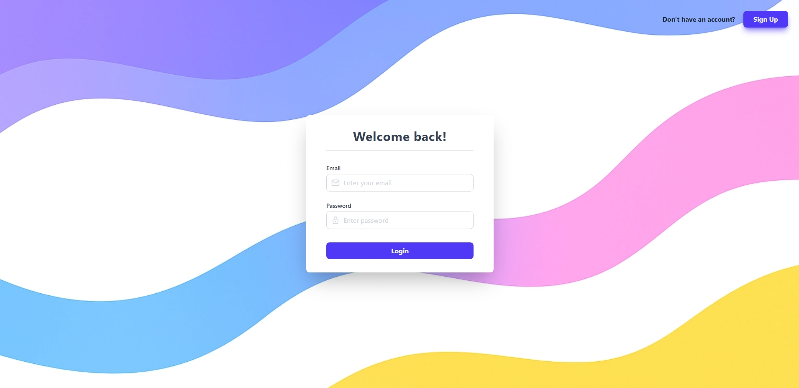
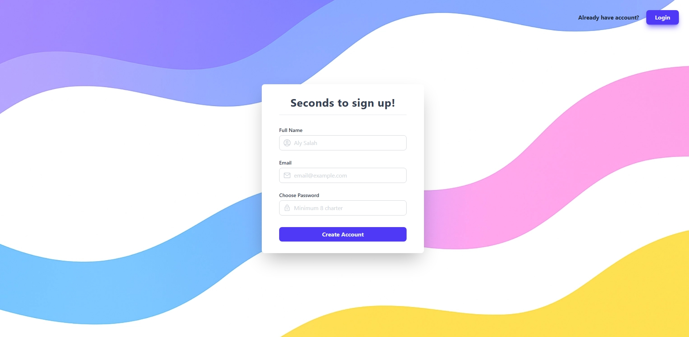
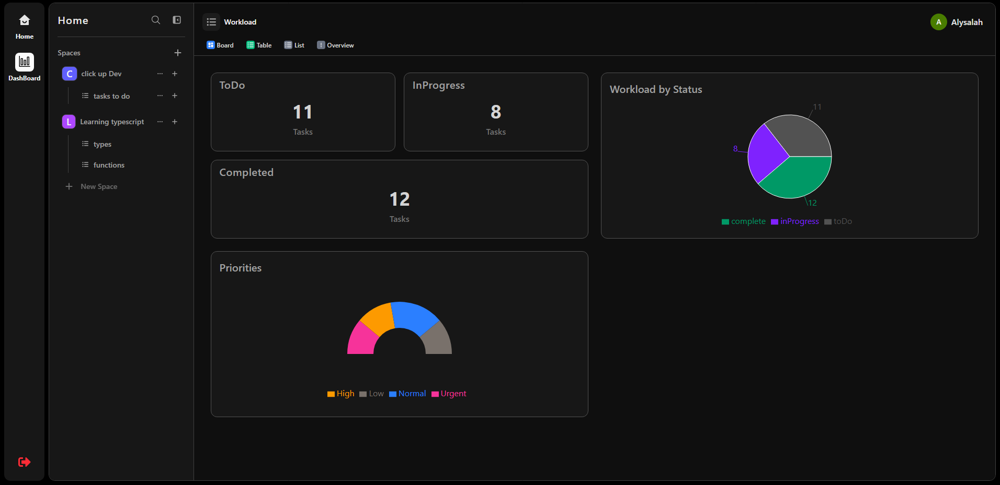
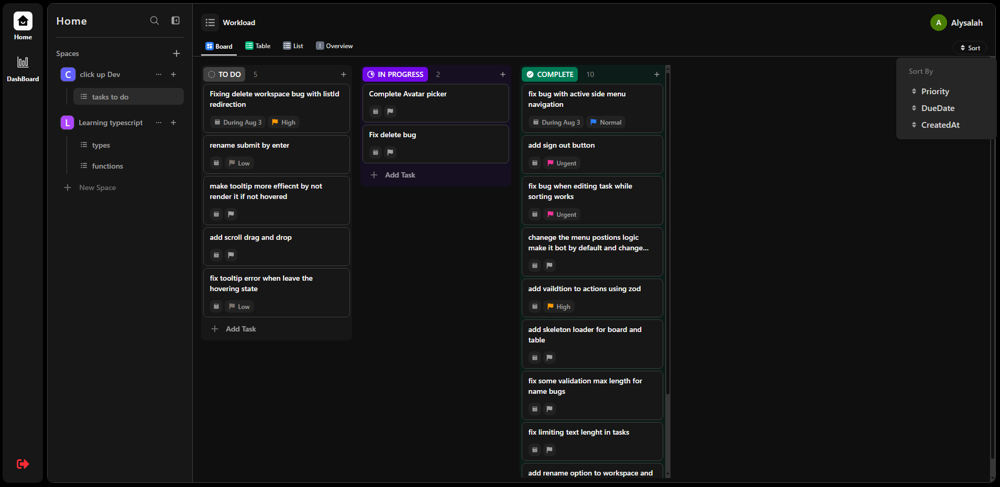
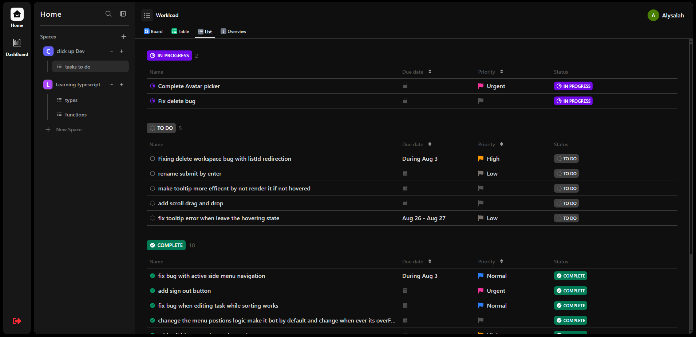
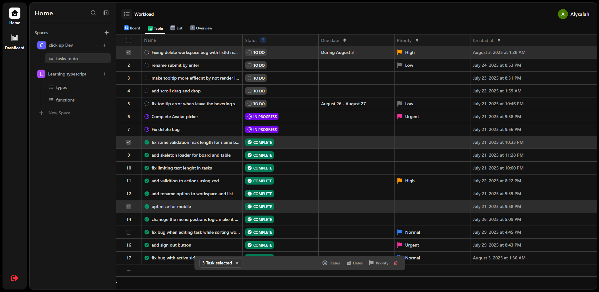
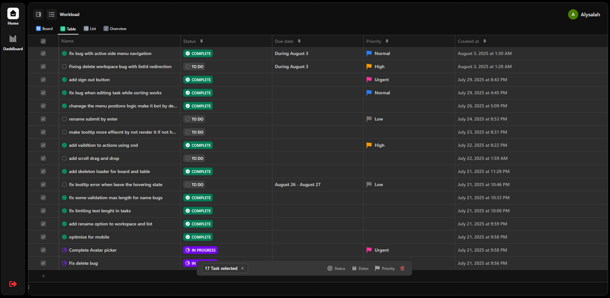
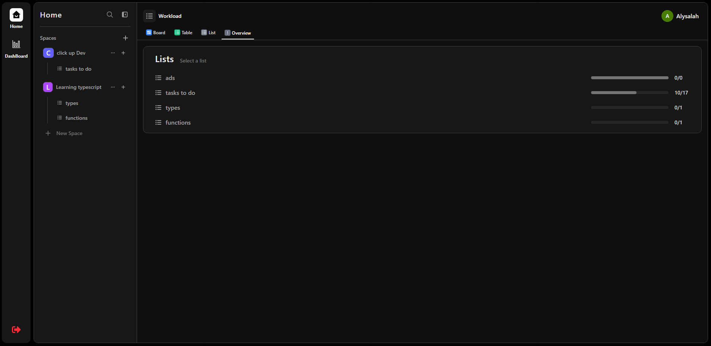

# ClickUp Clone - Full-Stack Project Management Application

A pixel-perfect recreation of ClickUp's core functionality, built entirely from scratch.  
This project showcases **modern React 19 development**, custom UI components, and a fully integrated backend, following scalable and maintainable coding practices.

**A full-stack ClickUp clone built with Next.js 15, React 19, Node.js, and MongoDB — featuring real-time drag-and-drop task management, custom UI components, and a secure authentication system.**

## 🚀 Live Demo

[**View Application**](https://click-up-clone-two.vercel.app/) • [**Frontend Repo**](https://github.com/alysalah83/Click-up-clone-front-end) • [**Backend Repo**](https://github.com/username/click-up-clone-backend)

---

## 🖼️ Application Preview

<div align="center">
  <table>
    <tr>
      <td align="center">
        
        <br>
        <strong>Home Page</strong>
      </td>
      <td align="center">
        
        <br>
        <strong>Login Page</strong>
      </td>
      <td align="center">
        
        <br>
        <strong>Signup Page</strong>
      </td>
    </tr>
    <tr>
      <td align="center">
        
        <br>
        <strong>Dashboard</strong>
      </td>
      <td align="center">
        
        <br>
        <strong>Board View</strong>
      </td>
    </tr>
    <tr>
      <td align="center">
        
        <br>
        <strong>List View</strong>
      </td>
      <td align="center">
        
        <br>
        <strong>Table View</strong>
      </td>
      <td align="center">
        
        <br>
        <strong>Table View 2</strong>
      </td>
    </tr>
    <tr>
      <td align="center" colspan="3">
        
        <br>
        <strong>Create Workspace</strong>
      </td>
       <td align="center">
        
        <br>
        <strong>Overview</strong>
      </td>
    </tr>
  </table>
</div>

---

## 📋 Overview

**"Manage your workspaces all in one"** – A complete project management platform featuring:

- **Workspace & project organization** with custom icons and colors
- **Drag-and-drop task boards** with real-time updates
- **Multiple view types** (Board, List, Table) for task management
- **Advanced task properties** (priority, dates, assignees, tags, status)
- **Bulk operations** for efficient task management
- **Dashboard analytics** with progress tracking and charts
- **Authentication system** with secure JWT implementation

Built with:

- **Next.js 15 + React 19 + TypeScript** for the frontend
- **Node.js + Express + MongoDB** for the backend
- **100% custom UI components** using Tailwind CSS (no external UI library)

---

## ✨ Features

### 🏢 Workspace & Project Management

- **Unlimited workspaces** with custom name, icon picker, and color picker
- **List organization** within workspaces for better project structure
- **Complete CRUD operations** with real-time UI updates
- **Workspace avatars** for visual identification

### 📝 Advanced Task Management

- **Multiple view types:**
  - **Board View** - Kanban-style drag-and-drop interface
  - **List View** - Clean, organized task listing
  - **Table View** - Spreadsheet-like detailed interface
- **Comprehensive task properties:**
  - Task names and rich descriptions
  - Status tracking with customizable workflows
  - Priority levels (Low, Medium, High, Urgent)
  - Due dates and flexible date ranges
  - Task assignees and team collaboration
  - Custom tags and labels
- **Drag-and-drop functionality** across all views with `@dnd-kit/core`
- **Bulk operations** - Select and manage multiple tasks simultaneously
- **Task filtering and search** for quick navigation

### 🔐 Authentication & Security

- **Sign up & login pages** with comprehensive form handling
- **Form validation** using `react-hook-form` + `zod` schemas
- **JWT-based authentication** with secure HTTP-only cookies
- **Protected routes** with automatic redirects
- **Session management** with token refresh capabilities

### 📊 Analytics & Dashboard

- **Task distribution charts** built with `recharts`
- **Progress tracking** with visual progress bars
- **Completion statistics** across workspaces and lists
- **Activity timeline** showing recent changes
- **Workload visualization** for better task management
- **Overview page** displaying all lists with progress indicators

### 🎨 Custom UI System

All components built from scratch using Tailwind CSS:

- **Navigation system** with collapsible sidebar
- **Modal framework** for forms and confirmations
- **Dropdown menus** with keyboard navigation
- **Toast notification system** for user feedback
- **Tooltip system** for contextual help
- **Skeleton loaders** for smooth loading states
- **Icon picker** with searchable icon library
- **Color picker** for workspace customization
- **Date range picker** for flexible scheduling
- **Responsive design** optimized for all devices

---

## 🛠 Tech Stack

### Frontend

- **Framework:** Next.js 15.4.1 (App Router) + React 19.0.0 + TypeScript
- **State Management:** Zustand 5.0.5
- **Data Fetching:** TanStack React Query 5.83.0 + Axios 1.10.0
- **Forms & Validation:** React Hook Form 7.60.0 + Zod 4.0.0 + @hookform/resolvers 5.1.1
- **Drag & Drop:** @dnd-kit/core 6.3.1
- **Date Handling:** react-date-range 2.0.1 + date-fns 4.1.0
- **UI & Styling:** Tailwind CSS + clsx 2.1.1
- **Icons:** React Icons 5.5.0
- **Charts:** Recharts 3.1.0
- **Cookies:** js-cookie 3.0.5

### Backend

- **Runtime & Framework:** Node.js + Express.js
- **Database:** MongoDB + Mongoose ODM
- **Validation:** Zod schemas for server-side validation
- **Authentication:** JWT with secure cookie implementation
- **API:** RESTful API with proper error handling
- **Security:** CORS configuration and request validation

### Development Tools

- **DevTools:** @tanstack/react-query-devtools 5.83.0
- **Optimization:** babel-plugin-react-compiler 19.1.0-rc.2
- **Type Safety:** Full TypeScript implementation across frontend and backend

---

## 🚀 Installation

### Prerequisites

- Node.js 18+
- MongoDB database
- Git

### Frontend Setup

```bash
# Clone the repository
git clone https://github.com/alysalah83/Click-up-clone-front-end.git
cd Click-up-clone-front-end

# Install dependencies
npm install

# Environment setup
cp .env.example .env.local

# Start development server
npm run dev
```

### Environment Variables

```env
# Frontend (.env.local)
NEXT_PUBLIC_API_URL=http://localhost:5000/api
NEXT_PUBLIC_JWT_SECRET=your-secret-key
NEXTAUTH_URL=http://localhost:3000

# Backend (.env)
PORT=5000
MONGODB_URI=mongodb://localhost:27027/clickup-clone
JWT_SECRET=your-jwt-secret
CORS_ORIGIN=http://localhost:3000
```

### Development Scripts

```bash
npm run dev          # Start development server
npm run build        # Build for production
npm run start        # Start production server
npm run lint         # Run ESLint
npm run type-check   # TypeScript checking
```

---

## 📁 Project Structure

```
src/
├── app/                    # Next.js 15 App Router
│   ├── (auth)/            # Authentication routes (login, signup)
│   ├── (dashboard)/       # Protected dashboard routes
│   ├── globals.css        # Global Tailwind styles
│   └── layout.tsx         # Root application layout
├── components/             # Custom UI components
│   ├── ui/                # Base components (buttons, modals, etc.)
│   ├── layout/            # Layout components (navbar, sidebar)
│   ├── forms/             # Form components with validation
│   └── features/          # Feature-specific components
├── hooks/                 # Custom React hooks
├── stores/                # Zustand state management
├── lib/                   # Utilities and API configuration
├── types/                 # TypeScript type definitions
└── utils/                 # Helper functions
```

---

## 🎯 Key Highlights

### Technical Achievements

- **100% Custom Components** - No external UI library dependencies
- **Modern React Patterns** - Latest React 19 features and Next.js 15 App Router
- **Type Safety** - Comprehensive TypeScript implementation
- **Performance Optimized** - React Query caching, Zustand state management
- **Accessibility** - Keyboard navigation and ARIA support
- **Responsive Design** - Mobile-first approach with seamless desktop experience

### Full-Stack Integration

- **Custom Backend API** - Built from scratch with Node.js and Express
- **Database Design** - Efficient MongoDB schema with proper relationships
- **Real-time Updates** - Optimistic UI updates with server synchronization
- **Error Handling** - Comprehensive error management across the stack
- **Security Implementation** - JWT authentication with secure cookie handling

### User Experience

- **Intuitive Interface** - Clean, modern design inspired by ClickUp
- **Smooth Interactions** - Drag-and-drop with visual feedback
- **Loading States** - Skeleton loaders for better perceived performance
- **Form Validation** - Real-time validation with helpful error messages
- **Responsive Feedback** - Toast notifications and loading indicators

---

## 💼 Portfolio Showcase

This project demonstrates proficiency in:

- **Modern Frontend Development** - React 19, Next.js 15, TypeScript
- **Custom UI Development** - Building scalable component libraries
- **State Management** - Efficient application state with Zustand
- **API Integration** - Seamless frontend-backend communication
- **Database Design** - MongoDB schema design and optimization
- **Authentication Systems** - Secure JWT implementation
- **Performance Optimization** - Code splitting, caching, and optimization
- **User Experience Design** - Intuitive interfaces and smooth interactions

---

**[🚀 Live Demo](https://click-up-clone-two.vercel.app/)** | **[📚 Repository](https://github.com/alysalah83/Click-up-clone-front-end)**

_A comprehensive demonstration of modern full-stack development capabilities_
