# ClickUp Clone - Full-Stack Project Management Application

---

## 🚀 Live Demo

[**View Application**](https://click-up-clone-two.vercel.app/) • [**Frontend Repo**](https://github.com/alysalah83/Click-up-clone-front-end) • [**Backend Repo**](https://github.com/alysalah83/Click-up-clone-back-end)

---

## 🖼️ Application Preview

  <table>
    <tr>
      <td align="center">
        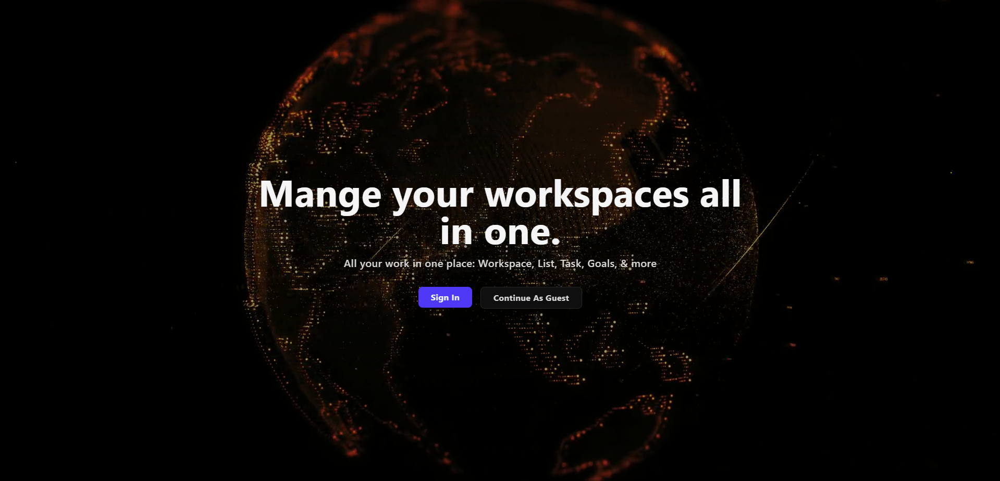
         
        <strong>Home Page</strong>
      </td>
      <td align="center">
        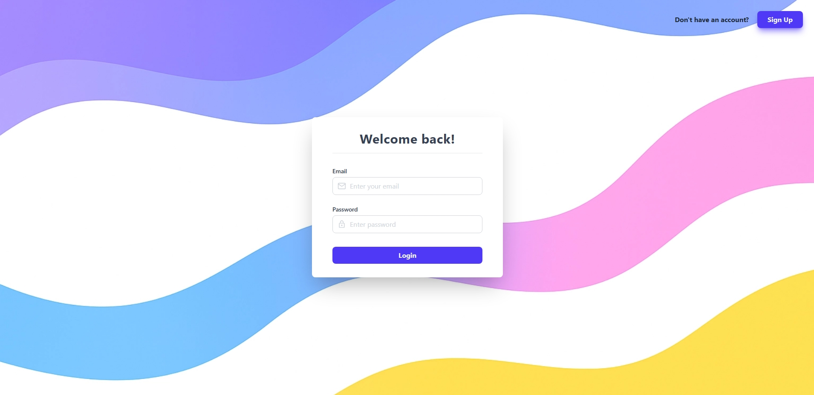
         
        <strong>Login Page</strong>
      </td>
      <td align="center">
        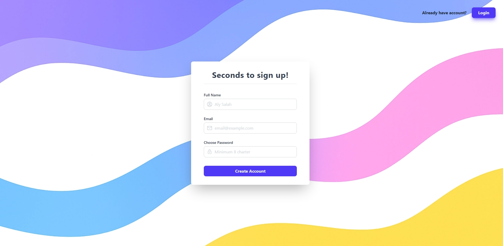
         
        <strong>Signup Page</strong>
      </td>
      <td align="center">
        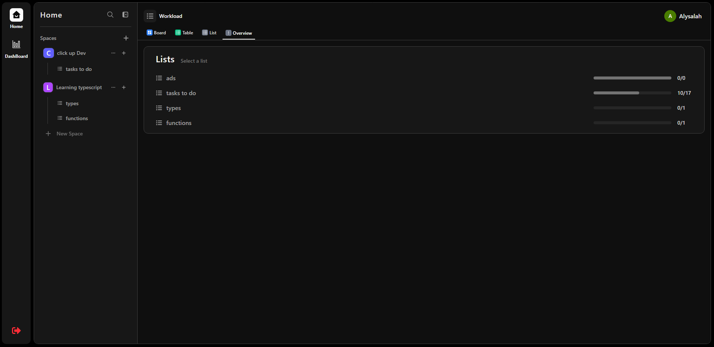
         
        <strong>Overview</strong>
      </td>
    </tr>
    <tr>
      <td align="center">
        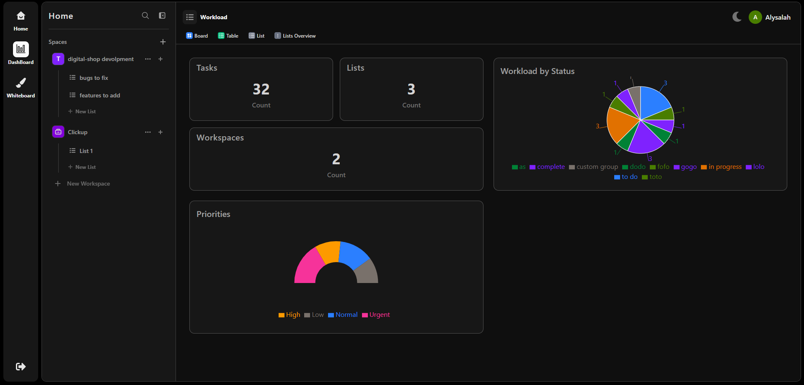
         
        <strong>Dashboard</strong>
      </td>
      <td align="center">
        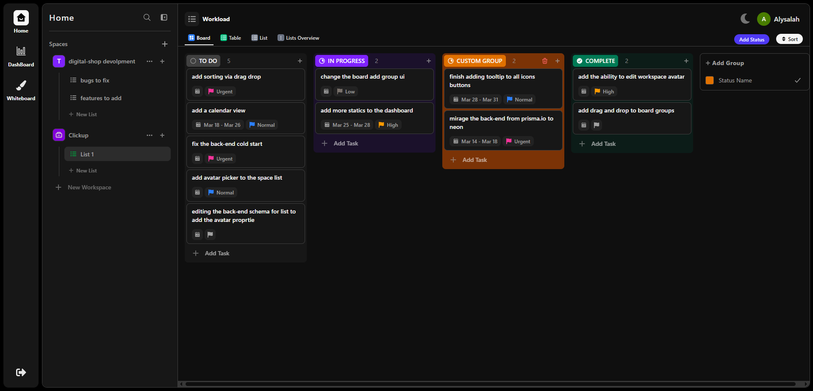
         
        <strong>Board View</strong>
      </td>
      <td align="center">
        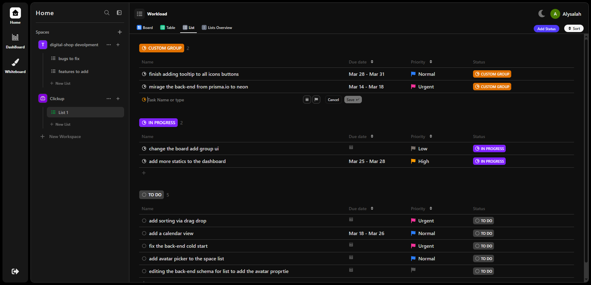
         
        <strong>List View</strong>
      </td>
      <td align="center">
        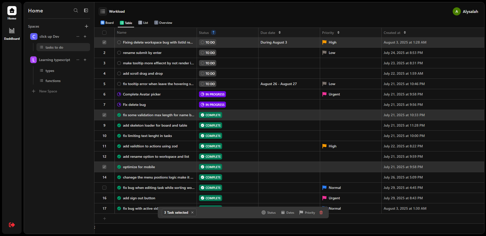
         
        <strong>Table View</strong>
      </td>
    </tr>
    <tr>
      <td align="center">
        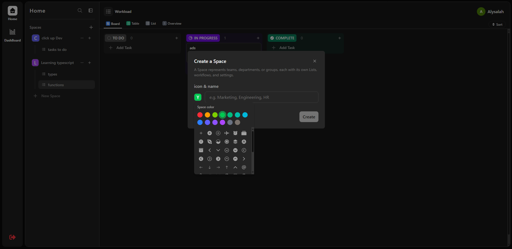
         
        <strong>Create Workspace</strong>
      </td>
      <td align="center">
        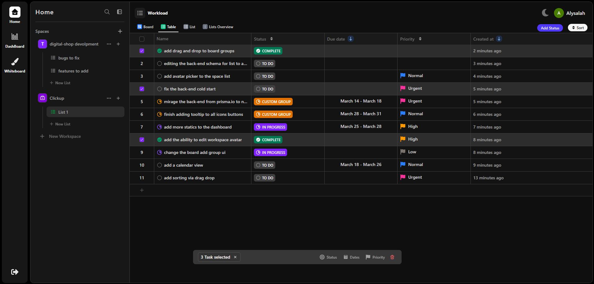
         
        <strong>Table View 2</strong>
      </td>
      <td align="center">
        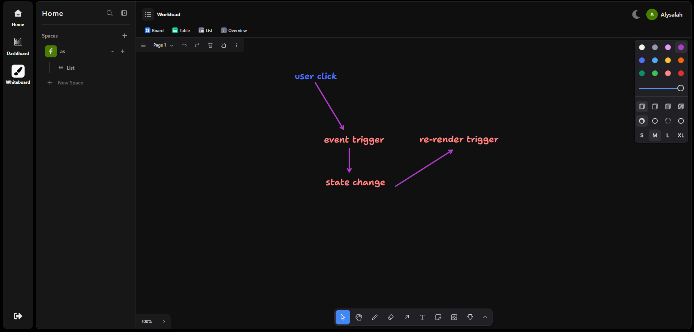
         
        <strong>Whiteboard Collaboration</strong>
      </td>
    </tr>
    <tr>
      <td align="center">
        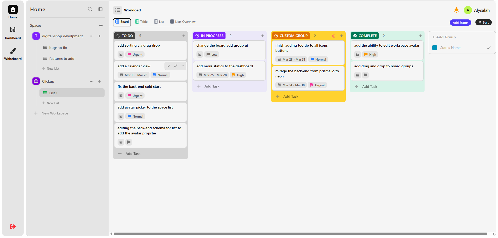
         
        <strong>Light Theme</strong>
      </td>
      <td align="center">
        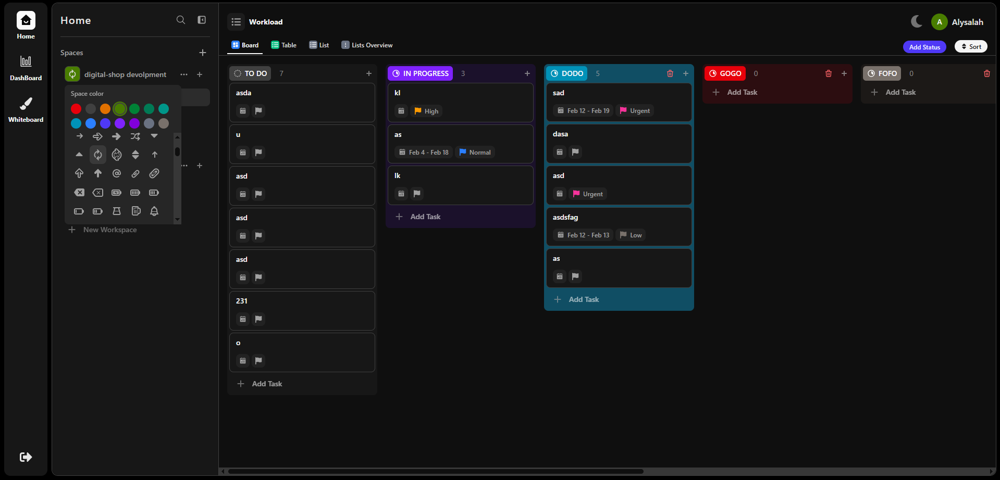
         
        <strong>Icon & Color Picker</strong>
      </td>
    </tr>
  </table>

---

## 🚀 Overview

A full-stack project management SaaS inspired by ClickUp, featuring a structured **Workspace → List → Status Group → Task** hierarchy, multiple task views, real-time analytics, collaborative whiteboarding, and parallel guest and authenticated user flows — built entirely solo with a 100% custom UI and no external component libraries.

---

## ✨ Features

### 🏢 Workspace & Project Management

- Unlimited workspaces with custom name, icon picker, and color picker
- Advanced workspace avatar system with icon selection and custom color theming
- Editable workspace properties with real-time preview
- List organization within workspaces for structured project management
- Complete CRUD operations with real-time UI updates

### 📋 Status Group System

- Create custom status groups per list to define your own workflow
- Tasks are attached to status groups, not hardcoded statuses
- Reorder, rename, and color-code status columns per project
- Structured hierarchy: **Workspace → List → Status Group → Task**

### 📝 Advanced Task Management

- **Multiple view types:**
  - **Board View** — Kanban-style drag-and-drop interface
  - **List View** — Clean, structured task listing
  - **Table View** — Spreadsheet-like interface with bulk operations
- **Comprehensive task properties:**
  - Task names and rich descriptions
  - Priority levels (Low, Medium, High, Urgent)
  - Due dates and flexible date ranges
  - Task assignees and team collaboration
  - Custom tags and labels
  - Status tracking via custom status groups
- Drag-and-drop task reordering and status changes via `@dnd-kit/core`
- Bulk operations — select and manage multiple tasks simultaneously
- Per-view sort persistence (status, priority, due date, created date — asc/desc), stored independently in Zustand per view

### 👤 User & Guest Flows

- Full authenticated user flow with sign up, login, and protected routes
- **Guest flow** — users can access and use the app without signing up
- On login, guests are prompted to choose whether to transfer their existing data to their account
- Session data isolated in cookies and merged safely on login based on user choice

### 🖌️ Whiteboard Collaboration

- Real-time collaborative whiteboard powered by **Excalidraw** (migrated from TLDraw)
- Drawing tools, shapes, text, and annotations
- Per-workspace whiteboard with export functionality
- Integration with workspace context for project-specific brainstorming

### 📊 Analytics & Dashboard

- Task distribution charts built with Recharts
- Progress tracking with visual progress bars
- Priority breakdown visualization (urgent/high/normal/low counts)
- Workspace-level and list-level task counts displayed as summary cards
- Completion statistics across workspaces and lists

### 🎨 Theme & Customization

- System-wide dark/light mode toggle
- Persistent theme preferences saved to user profile
- Custom workspace branding with icon and color picker
- Theme-aware components throughout

### 🔐 Authentication & Security

- JWT-based authentication with secure HTTP-only cookies
- No sensitive data stored in localStorage
- Protected routes with automatic redirects
- Form validation using React Hook Form + Zod
- Parallel guest flow with safe session isolation

### 🧩 Custom UI System

All components built from scratch in Tailwind CSS using the **compound component pattern** — parent controls shared state via context, keeping consumer APIs clean across all feature surfaces:

- Collapsible sidebar navigation
- Modal framework (compound component)
- Dropdown menus with keyboard navigation (compound component)
- Tooltip system (compound component)
- Icon Picker with searchable icon library
- Color Picker for workspace and status customization
- Date range picker
- Toast notification system
- Skeleton loaders for smooth loading states
- Theme toggle with smooth transitions
- Fully responsive across all devices

### 🧪 Testing

- Integration and unit tests with **Vitest** and **React Testing Library**
- Tests cover task mutations, state persistence, and interaction flows
- Added after a full architectural refactor to ensure stability

---

## 🛠️ Tech Stack

### Frontend

| Layer              | Technology                                       |
| ------------------ | ------------------------------------------------ |
| Framework          | Next.js (App Router) + React + TypeScript        |
| State Management   | Zustand                                          |
| Data Fetching      | TanStack React Query + Axios                     |
| Forms & Validation | React Hook Form + Zod                            |
| Drag & Drop        | @dnd-kit/core                                    |
| Whiteboard         | Excalidraw                                       |
| Charts             | Recharts                                         |
| Date Handling      | react-date-range + date-fns                      |
| UI & Styling       | Tailwind CSS (100% custom, no component library) |
| Icons              | React Icons + Lucide React                       |
| Testing            | Vitest + React Testing Library                   |

### Backend

| Layer               | Technology                                 |
| ------------------- | ------------------------------------------ |
| Runtime & Framework | Node.js + Express.js + TypeScript          |
| Database & ORM      | Prisma ORM + PostgreSQL                    |
| Validation          | Zod (server-side)                          |
| Authentication      | JWT with HTTP-only cookies                 |
| API                 | RESTful API with structured error handling |
| Security            | CORS configuration + request validation    |

---

## 📌 What This Project Demonstrates

- **Scalable architecture** — Workspace → List → Status Group → Task hierarchy with flexible, user-defined workflows
- **Full-stack ownership** — sole developer across frontend, backend, database schema, and deployment
- **Production-ready patterns** — optimistic updates, per-view state persistence, guest/auth flow isolation, typed backend with Prisma
- **Component engineering** — compound component system built from scratch with no external UI library dependency
- **Testing discipline** — Vitest + RTL coverage added after a full architectural refactor
- **Stack evolution** — migrated whiteboard from TLDraw to Excalidraw and backend from MongoDB/Mongoose to Prisma ORM + PostgreSQL based on project requirements

**[🚀 Live Demo](https://click-up-clone-two.vercel.app/)** | **[📚 Repository](https://github.com/alysalah83/Click-up-clone-front-end)**

_A comprehensive demonstration of modern full-stack development capabilities with advanced features including whiteboard collaboration and theme system._
