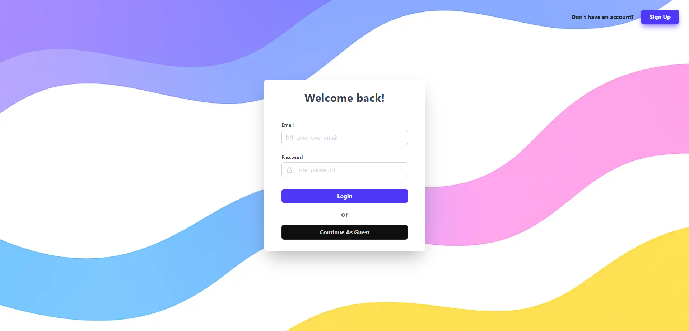
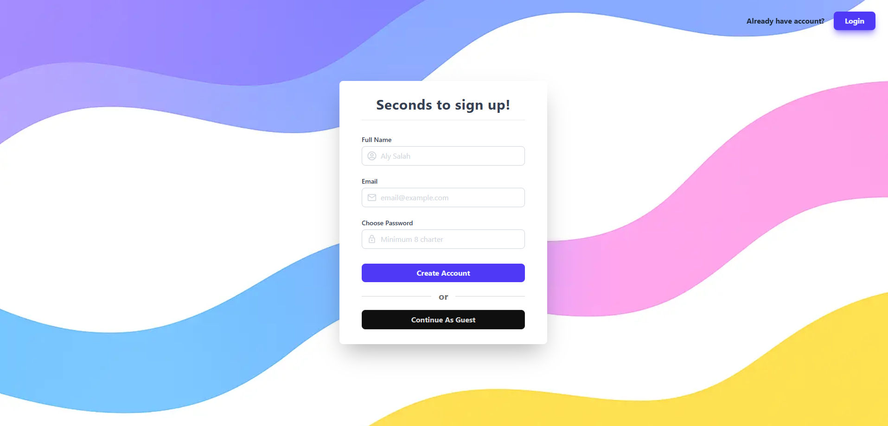
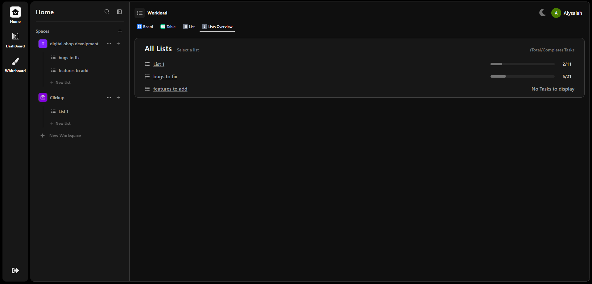
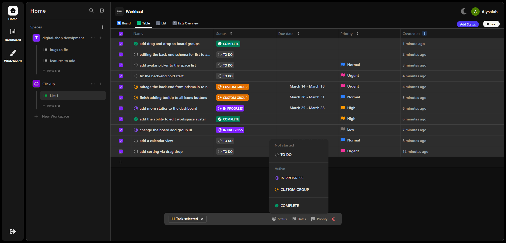
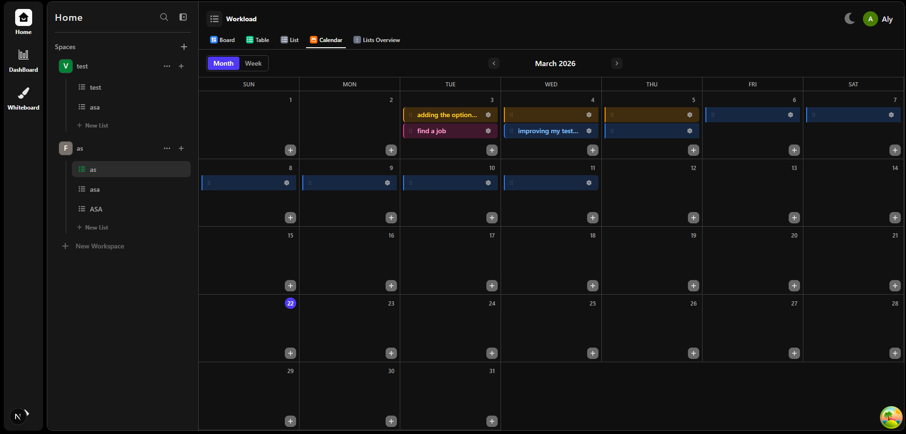
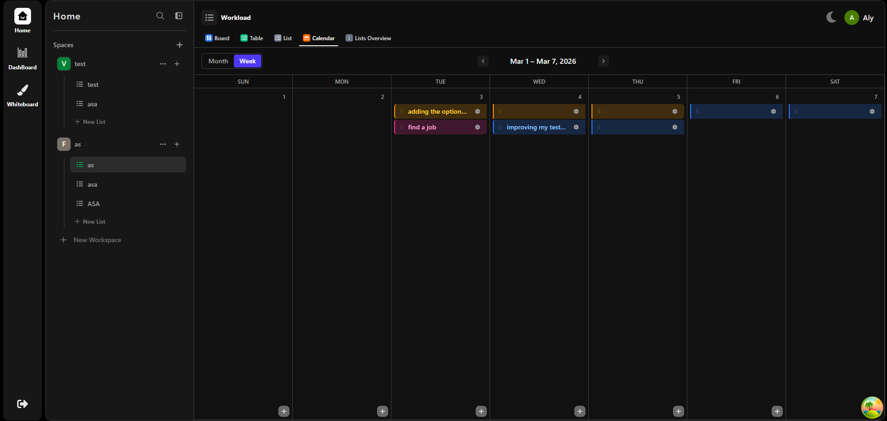
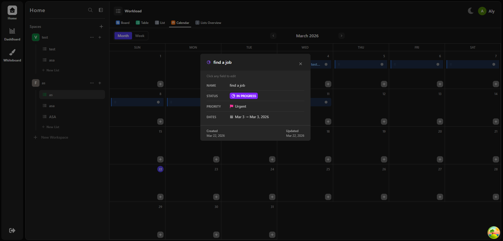
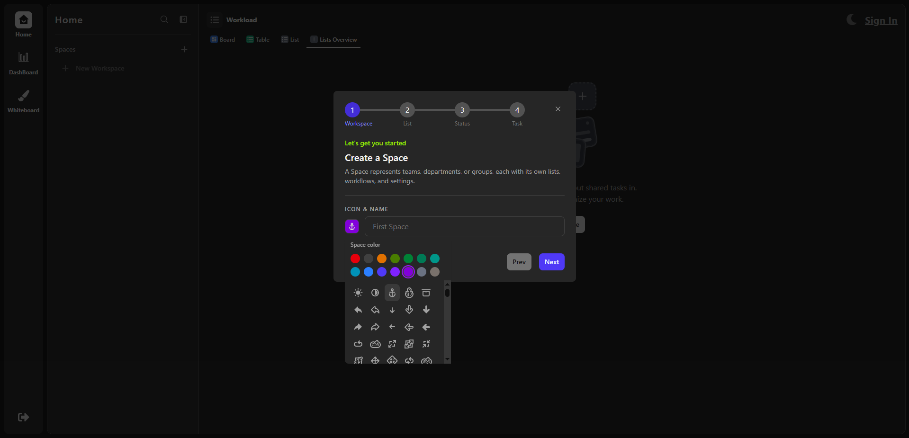
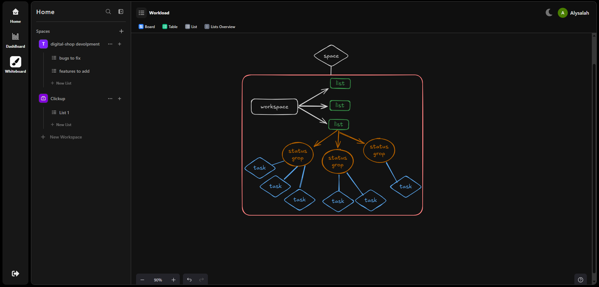

# ClickUp Clone — Full-Stack Project Management Application

---

## 🚀 Live Demo

[**View Application**](https://click-up-clone-two.vercel.app/) • [**Frontend Repo**](https://github.com/alysalah83/Click-up-clone-front-end) • [**Backend Repo**](https://github.com/alysalah83/Click-up-clone-back-end)

---

## 🖼️ Application Preview

  <table>
    <tr>
      <td align="center">
        
         
        <strong>Home Page</strong>
      </td>
      <td align="center">
        
         
        <strong>Login Page</strong>
      </td>
      <td align="center">
        
         
        <strong>Signup Page</strong>
      </td>
      <td align="center">
        
         
        <strong>Overview</strong>
      </td>
    </tr>
    <tr>
      <td align="center">
        
         
        <strong>Dashboard</strong>
      </td>
      <td align="center">
        
         
        <strong>Board View</strong>
      </td>
      <td align="center">
        
         
        <strong>List View</strong>
      </td>
      <td align="center">
        
         
        <strong>Table View</strong>
      </td>
    </tr>
    <tr>
      <td align="center">
        
         
        <strong>Table View 2</strong>
      </td>
      <td align="center">
        
         
        <strong>Calendar — Month View</strong>
      </td>
      <td align="center">
        
         
        <strong>Calendar — Week View</strong>
      </td>
      <td align="center">
        
         
        <strong>Calendar — Task Detail Panel</strong>
      </td>
    </tr>
    <tr>
      <td align="center">
        
         
        <strong>Create Workspace</strong>
      </td>
      <td align="center">
        
         
        <strong>Whiteboard Collaboration</strong>
      </td>
      <td align="center">
        
         
        <strong>Light Theme</strong>
      </td>
      <td align="center">
        
         
        <strong>Icon & Color Picker</strong>
      </td>
    </tr>
  </table>

---

## 🚀 Overview

A full-stack project management SaaS inspired by ClickUp, built entirely solo with no external UI component libraries. It features a structured **Workspace → List → Status Group → Task** hierarchy, four distinct task views each with their own interaction model, optimistic updates on every mutation, real-time analytics, collaborative whiteboarding, and parallel guest and authenticated user flows — all powered by a 100% custom component system built with the compound component pattern in Tailwind CSS.

---

## ✨ Features

### 🏢 Workspace & Project Management

- Unlimited workspaces with custom name, icon picker, and color picker
- Advanced workspace avatar system with icon selection and custom color theming
- Editable workspace properties with real-time preview
- List organization within workspaces for structured project management
- Complete CRUD operations with real-time UI updates

### 📋 Status Group System

- Create custom status groups per list to define your own workflow
- Tasks are attached to status groups, not hardcoded statuses
- Reorder, rename, and color-code status columns per project
- Structured hierarchy: **Workspace → List → Status Group → Task**

---

### 📝 Task Views

All four views share the same underlying task data and mutations, with **optimistic updates via TanStack Query on every action** — renames, priority changes, status moves, date edits, and deletions all reflect instantly without waiting for a server response. Each view has its own **sort menu** (by status, priority, due date, or created date — ascending or descending) with sort state persisted independently per view in Zustand, so switching views never resets your preferences.

---

#### 🗂️ Board View

The Board view organizes tasks into columns by status group, giving a clear Kanban-style overview of where every task stands.

- **Drag and drop** tasks between status columns via `@dnd-kit/core` — status updates optimistically on drop
- Each task card supports **inline editing directly on the card**: click the name to rename it in place, click the priority indicator to change priority, and click the date field to open a date range picker — no modal required
- A **dropdown menu** on each card provides quick actions: rename, delete, and open the full Task Detail Panel
- The **Task Detail Panel** opens as a modal with clean field-by-field editing for name, status, priority, and date range — shared with Calendar view
- Each status column has an **Add Task** form that creates a new task scoped to that column's status, with fields for name, priority, and dates
- A dedicated **Add Status** button at the end of the board creates a new status column inline

---

#### 📋 List View

The List view groups tasks by status in a clean linear layout, optimized for scanning active work without the noise of completed items.

- Tasks are grouped under their status heading with clear visual separation
- **Completed status tasks are hidden** by default to keep the view focused on what's in progress
- Same inline editing model as Board view — name, priority, and dates are all editable in place per task row
- Sort menu in the header to reorder tasks within each status group
- Add task button per status group for quick task creation scoped to that status

---

#### 📊 Table View

The Table view presents tasks as a spreadsheet-like grid, built for power users who need to scan and manage many tasks at once.

- Each row is a task with dedicated slots for **name**, **priority**, **dates**, and **created at**
- Clicking the **name slot** activates a smooth inline rename input directly in the cell
- Clicking **priority, date, or status slots** opens a contextual dropdown menu to change the value — editing happens without leaving the table
- Each row has a **checkbox** for individual selection; a **header checkbox** selects all tasks at once
- Selecting one or more tasks reveals a floating **action bar** with bulk operations: update status, priority, or dates across all selected tasks simultaneously, or delete them all in one action
- **Column headers double as sort triggers** — click any column header to sort the table by that field

---

#### 📅 Calendar View

The Calendar view maps tasks onto a time grid by their start and end dates, making scheduling and deadline management visual and intuitive — built from scratch without any calendar library.

- **Month and week toggle** — switch between a full-month grid and a focused 7-day week layout; navigation steps by month or by week accordingly
- **Date-range spanning** — tasks with a start and end date render as a continuous bar spanning every day they cover, with rounded edges marking the exact start and end boundaries
- **Drag to reschedule** — drag any task to a new day cell; both start and end dates shift together, preserving the original duration; a dedicated drag handle keeps click and drag zones isolated
- **Inline task creation** — click the `+` button on any day cell to open a creation form scoped to that date, with fields for name and priority
- **Task Detail Panel** — click the settings button on any task to open the same detail panel used in Board view, with full inline editing for name, status, priority, and date range

---

### 👤 User & Guest Flows

- Full authenticated user flow with sign up, login, and protected routes
- **Guest flow** — users can explore and use the full app without signing up
- On login, guests are prompted to choose whether to transfer their existing workspace data into their new account
- Guest session data is isolated in cookies and merged safely on login based on user choice — no data loss

### 🖌️ Whiteboard Collaboration

- Real-time collaborative whiteboard powered by **Excalidraw** (migrated from TLDraw)
- Drawing tools, shapes, text, and annotations
- Per-workspace whiteboard with export functionality
- Integration with workspace context for project-specific brainstorming

### 📊 Analytics & Dashboard

- Task distribution charts built with Recharts
- Progress tracking with visual progress bars
- Priority breakdown visualization (urgent / high / normal / low counts)
- Workspace-level and list-level task counts displayed as summary cards
- Completion statistics across workspaces and lists

### 🎨 Theme & Customization

- System-wide dark/light mode toggle
- Persistent theme preferences saved to user profile
- Custom workspace branding with icon and color picker
- Theme-aware components throughout

### 🔐 Authentication & Security

- JWT-based authentication with secure HTTP-only cookies
- No sensitive data stored in localStorage
- Protected routes with automatic redirects
- Form validation using React Hook Form + Zod
- Parallel guest flow with safe session isolation

### 🧩 Custom UI System

All components built from scratch in Tailwind CSS using the **compound component pattern** — parent controls shared state via context, keeping consumer APIs clean and prop drilling eliminated across all feature surfaces:

- Collapsible sidebar navigation
- Modal with both controlled and uncontrolled modes
- Dropdown menus with keyboard navigation
- Menu with self poistion in overflowing
- Tooltip system
- Icon Picker with searchable icon library
- Color Picker for workspace and status customization
- Date range picker
- Toast notification system
- Skeleton loaders for smooth loading states
- Theme toggle with smooth transitions
- Fully responsive across all devices

### 🧪 Testing

- Integration and unit tests with **Vitest** and **React Testing Library**
- Tests cover task mutations, guest/auth state persistence, and interaction flows
- Added after a full architectural refactor to validate correctness

---

## 🛠️ Tech Stack

### Frontend

| Layer              | Technology                                       |
| ------------------ | ------------------------------------------------ |
| Framework          | Next.js (App Router) + React + TypeScript        |
| State Management   | Zustand                                          |
| Data Fetching      | TanStack React Query + Axios                     |
| Forms & Validation | React Hook Form + Zod                            |
| Drag & Drop        | @dnd-kit/core                                    |
| Whiteboard         | Excalidraw                                       |
| Charts             | Recharts                                         |
| Date Handling      | react-date-range + date-fns                      |
| UI & Styling       | Tailwind CSS (100% custom, no component library) |
| Icons              | React Icons + Lucide React                       |
| Animation          | Motion (Framer Motion)                           |
| Testing            | Vitest + React Testing Library                   |

### Backend

| Layer               | Technology                                 |
| ------------------- | ------------------------------------------ |
| Runtime & Framework | Node.js + Express.js + TypeScript          |
| Database & ORM      | Prisma ORM + PostgreSQL                    |
| Validation          | Zod (server-side)                          |
| Authentication      | JWT with HTTP-only cookies                 |
| API                 | RESTful API with structured error handling |
| Security            | CORS configuration + request validation    |

---

## 📌 What This Project Demonstrates

- **Scalable architecture** — Workspace → List → Status Group → Task hierarchy with fully user-defined workflows and flexible data modeling
- **Full-stack ownership** — sole developer across frontend, backend, database schema, and deployment
- **Production-ready patterns** — optimistic updates on every mutation, per-view sort state persistence, guest/auth session isolation, and a fully typed backend with Prisma
- **View engineering** — four independently designed task views (Board, List, Table, Calendar) each with its own interaction model, editing surface, and sort state, all sharing a single data layer
- **Component engineering** — compound component system built entirely from scratch with no external UI library; includes a calendar grid engine built without any calendar library, a controlled/uncontrolled Modal, drag-and-drop with isolated click zones, and a reusable Task Detail Panel shared across views
- **Testing discipline** — Vitest + RTL coverage added post-refactor to ensure behavioral correctness across guest and auth flows
- **Stack evolution** — migrated whiteboard from TLDraw to Excalidraw and backend from MongoDB/Mongoose to Prisma ORM + PostgreSQL based on project requirements

**[🚀 Live Demo](https://click-up-clone-two.vercel.app/)** | **[📚 Repository](https://github.com/alysalah83/Click-up-clone-front-end)**

_A comprehensive demonstration of modern full-stack development — four task views with distinct interaction models, a fully custom UI system, optimistic updates throughout, and collaborative whiteboarding._
